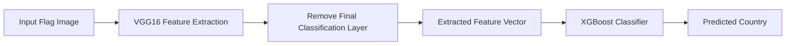

# South American Flag Classification with VGG16 + XGBoost


## Project Overview

This project performs **highly accurate image classification** of South American country flags using a **hybrid deep learning approach**. I utilize **VGG16 for feature extraction** and **XGBoost for classification**, achieving **97% test accuracy** on a custom dataset of over **10,000 flag images**.

---

##  Key Features

- Hybrid architecture combining VGG16 with XGBoost
- 97% test accuracy on South American flags  
- Comprehensive training and evaluation pipeline   
- Detailed performance visualizations  

---

## Model Architecture


---

### Accuracy Metrics

| Metric         | Value               |
|----------------|---------------------|
| Accuracy       | 97.0%           |
| Dataset Size   | ~10,000 images      |
| Classes        | 12 South American countries |

---

### Confusion Matrix


### Training Progress

| Accuracy Progress | Loss Reduction |
|------------------|----------------|
|  |  |

---


---

### `Notes`:

```markdown

- Model optimized specifically for South American flags  
- Automatic image resizing during inference  
- Internet connection required for initial download of the model. 
- Trained model hosted on Hugging Face:  
  🔗 [flag_classifier_vgg16.h5 – 116 MB](https://huggingface.co/7mgppp/flag-classifier-vgg16-model/blob/main/flag_classifier_vgg16.h5)
```
---


